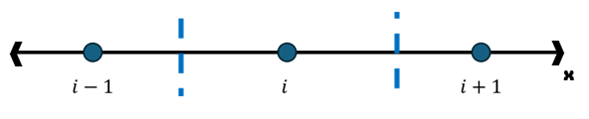

# Conducción

El fenómeno de conducción presenta 3 propiedades:

* Es un fenómeno local. Toda interacción ocurre desde un punto solo a sus inmediaciones
* Tienen una dirección preferencial: la que apunte al sitio de menor temperatura
* Se conserva al conducirse

## Ecuación de difusión de calor / Ecuación de conducción

La ecuación de difusión de calor se basa en la ley de Fourier y la conservación de la energía. En su forma general se representa como:

Cuando ρ (densidad), cp (calor específico) y k (conductividad térmica) no son constantes (pueden depender de T, x, etc.), ya no puedes usar la forma simplificada con α. Debes partir del balance general de energía:

$$
\frac{\partial \rho c_p T}{\partial t}
=
\nabla \cdot \left( k \nabla T \right)
+ \dot{q}
$$

En su forma general:

$$
\frac{\partial T}{\partial t} = \alpha \nabla^2 T
$$

Donde $\alpha = \frac{k}{\rho c_p}$, se le conoce como **coeficiente de difusión** y representa la relación entre la energía transferida con el incremento de la temperatura.

<!-- ¿Que representaba el alpha fisicamente? Explicar a detalle, tal vez alguna visualización -->

En su forma expandida:

$$
\frac{\partial T}{\partial t} = \alpha \left( \frac{\partial^2 T}{\partial x^2} + \frac{\partial^2 T}{\partial y^2} + \frac{\partial^2 T}{\partial z^2} \right)
$$

"Si los flux de energía convergen la temperatura sube"

<!-- ¿Que representaba fisicamente los efectos del operador nabla y convergencia? 
Realizar la analogía a un campo de temperaturas, y observar su visualización vectorial  -->

## Método de diferencias finitas

Sobre los métodos de discretización:

Pueden ser hasta polígonos irregulares

Para el caso de mallas orenadas con numeración secuencial se les llama **Mallas estrucutradas**. Son las misma que en emplearemos en modelos de convección.

Partimos el espacio en volúmenes de control que despues enumeraremos, debemos conocer de cada uno:
- Su volumen
- Los nodos vecinos

Discretizamos el campo de tempertauras espacial con pequeños espacios donde cada uno tiene una temperatura constante. Aproxiamos las derivadas de la ecuación de conducción, aplicada para cada volumen de control con sus vecinos,como una diferencia entre nodos vecinos:

La derivada de la temperatura con respecto al espacio en x entre dos volumenes de control lo aproximamos con la la deferencia de temperatura entre ambos volúmenes con respecto a la distancia que les separa.

$$
Izq: \left(\frac{\partial T}{\partial x}\right)^- = \frac{T_i - T_{i-1}}{\Delta x}
$$

$$
Der: \left(\frac{\partial T}{\partial x}\right)^+ \approx \frac{T_{i+1} - T_{i}}{\Delta x}
$$

Por último, la segunda derivada parcial de la temperatura con rexpecto a x, será la diferencia entre la derivadas por la derecha y la derivada por la izquierda entre su la distancia:

$$
2da: \left(\frac{\partial^2 T}{\partial x}\right)_i \approx \frac{\left(\frac{\partial T}{\partial x}\right)^+ - \left(\frac{\partial T}{\partial x}\right)^-}{\Delta x} = \frac{\frac{T_{i+1} - T_{i}}{\Delta x} - \frac{T_i - T_{i-1}}{\Delta x}}{\Delta x} 
$$

Simplificando la expresión:

$$
\boxed{
\left(\frac{\partial^2 T}{\partial^2 x}\right)_i \approx \frac{1}{\Delta x^2}(T_{j+1} - 2T_{j} + T_{j-1})
}
$$

De la ecuación de conducción nos queda aproximar la derivada parcial de la temperatura con respecto al tiempo. Mismo que aprximamos como el cambio de T con respecto a un paso siguiente de tiempo. Lo denotamos con el superindice t y t+1, para el tiempo presente y el tiempo en el paso de tiempo siguiente.

$$
\frac{\partial T}{\partial t} \approx \frac{T_i^{t+1} - T_i^{t}}{ \Delta t}
$$

Conjando ambas aproximaciones:

$$
\begin{gather}
T_i^{t+1} - T_i^{t} = \frac{\alpha \Delta t}{\Delta x^2}(T_{i+1} - 2T_{i} + T_{i-1}) \\
 \frac{\alpha \Delta t}{\Delta x^2} =  \varphi \text{    (Número de Fourier) }
\end{gather}
$$

El numero de Fourier reprensenta bla bla.

Aun queda por resolver el cambio en el tiempo de las derivadas espaciaels pues la evolución del problema está mediado por los cambios de temperatura en el espacio, por lo que debemos analizar tambien como cambia a cada paso de tiempo las derivadas en el término de la derecha.

#### Dependencia temporal

::: {.callout-note title="Método explícito"}

En la forma explícita todas son variables conocidas excepto $T_i^{t+1}$

:::

::: {.callout-note title="Método implícito"}
Ahora todos los terminos de la derecha son desconocidas y solo conocemos $T_i^{t}$

$$
T_i^{t+1} - T_i^{t} = \varphi (T_{i+1}^{t+1} - 2T_{i}^{t+1} + T_{i-1}^{t+1})
$$

Despejando $T_i^{t}$ obtenemos:

$$
T_i^{t} = -\varphi T_{i+1}^{t+1} + (1+2\varphi)T_{i}^{t+1} - \varphi T_{i-1}^{t+1}
$$
:::

## Matriz de conducción 

Empleamos el método implíto para la representación de la Matriz de conducción. Debemos evaluar la ecuación de conducción propuesta por diferencias finitas en su forma implícita pero para cada nodo en que discretizemos el dominio.

Observamos en la ecuación de transporte como los efectos de conducción solo se trasladan desde el nodo i hasta sus nodos vecinos (i+1, i-1). Por lo que la resolución de la ecuación evaluada en cada nodo presentará tres incognitas supeditadas a las temperaturas en el tiempo t+1 en los nodos i-1, i e i+1.

::: {.callout-note}
### Sistema tridiagonal

$$
\begin{array}{rcl}
(1+2\varphi)T_1^{t+1} & -\varphi T_2^{t+1} &= T_1^{t} \\
-\varphi T_1^{t+1} & + (1+2\varphi)T_2^{t+1} & -\varphi T_3^{t+1} = T_2^{t} \\
& -\varphi T_2^{t+1} + (1+2\varphi)T_3^{t+1} & -\varphi T_4^{t+1} = T_3^{t} \\
& & -\varphi T_3^{t+1} + (1+2\varphi)T_4^{t+1} -\varphi T_5^{t+1} = T_4^{t} 
\end{array}
$$

:::

El sistema de ecuaciones presenta una forma tridiagonal semejante por la diagonal del centro. Por último planteamos la matriz correspondiente representada de la forma:

$$
\begin{equation}
    A * T^{t+1} = T^t
\end{equation}
$$

$$
\begin{equation}
    
\begin{bmatrix}
(1+2\phi) & -\phi & 0 & 0 & 0 \\
-\phi & (1+2\phi) & -\phi & 0 & 0 \\
0 & -\phi & (1+2\phi) & -\phi & 0 \\
0 & 0 & -\phi & (1+2\phi) & -\phi \\
0 & 0 & 0 & -\phi & (1+2\phi)
\end{bmatrix}
\begin{bmatrix}
T_1 \\
T_2 \\
T_3 \\
T_4 \\
T_5
\end{bmatrix}
=
\begin{bmatrix}
T_1 \\
T_2 \\
T_3 \\
T_4 \\
T_5
\end{bmatrix}
+
\phi
\begin{bmatrix}
T_{F1} \\
0 \\
0 \\
0 \\
T_{F2}
\end{bmatrix}

\end{equation}
$$

Se añaden los efectos de frontera

