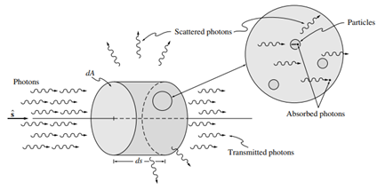

# Interacciones con la frontera

propiedades de radiación de los medios participantes. es decir, cómo una sustancia puede absorber, emitir y dispersar la radiación térmica

A continuación, desarrollaremos expresiones para esta
atenuación para un haz de luz que viaja dentro de un haz de rayos en la dirección $\hat{s}$.

### ATENUACIÓN POR ABSORCIÓN Y DISPERSIÓN

Si el medio a través del cual viaja la energía radiativa es “participante”, entonces cualquier haz incidente
se atenuará por absorción y dispersión mientras viaja a través del medio (Modest)

{width=80%}

**Absorción**

$$
dI_{\eta} = -\kappa_{\eta} I_{\eta}\, ds
$$

donde la constante de proporcionalidad $\kappa$ se conoce como el coeficiente de absorción (lineal), y el signo negativo se ha introducido ya que la intensidad disminuye

La integración de la ecuación sobre una trayectoria geométrica **s** da como resultado: (NO ES ESTA INTEGRAL)

$$
\tau_{\eta} = \int_{0}^{s} \kappa_{\eta}\, ds
$$

Donde $\tau$ es el espesor óptico (de absorción) a través del cual ha viajado el haz e Iη(0) es la intensidad que entra en el medio en $s = 0$. Nótese que el coeficiente de absorción (lineal) es el inverso del camino libre medio de un fotón hasta que se absorbe.

**Scattering o dispersión**

$$
(dI_{\eta})_{\mathrm{sca}} = -\sigma_{s\eta} I_{\eta}\, ds
$$

Donde la constante de proporcionalidad $\sigma_{s\eta}$ es el coeficiente de dispersión (lineal) para la dispersión del haz de rayos considerado en todas las demás direcciones.

**Coeficiente de extinsión**

Es la atenuación total de la intensidad de un haz de rayos debido tanto a la absorción como a la dispersión se conoce como extinción. Por lo tanto, el coeficiente de extinción se define como:

$$
\beta_{\eta} = \kappa_{\eta} + \sigma_{s\eta}
$$

### AUMENTO POR EMISIÓN Y DISPERSIÓN

Un haz de luz que viaja a través de un medio participante en la dirección $\hat{s}$ pierde energía por absorción y por dispersión en dirección opuesta a la de su propagación. Pero al mismo tiempo, también gana energía por emisión, así como por dispersión desde otras direcciones hacia la dirección de propagación $\hat{s}$.

**Emisión**

$$
(dI_{\eta})_{\mathrm{em}} = j_{\eta}\, d = \kappa_{\eta} I_{b\eta}\, ds
$$

donde $j_{\eta}$ se denomina coeficiente de emisión. Dado que, en equilibrio termodinámico local, la intensidad en todas partes debe ser igual a la intensidad del cuerpo negro,

$$
j_{\eta} = \kappa_{\eta} I_{b\eta}
$$

**In-scatering**

Este último es más dificil de explicar, hay q explicar con imágenes

## Interacción volumétricas y superficiales

BLA BLA BLA

